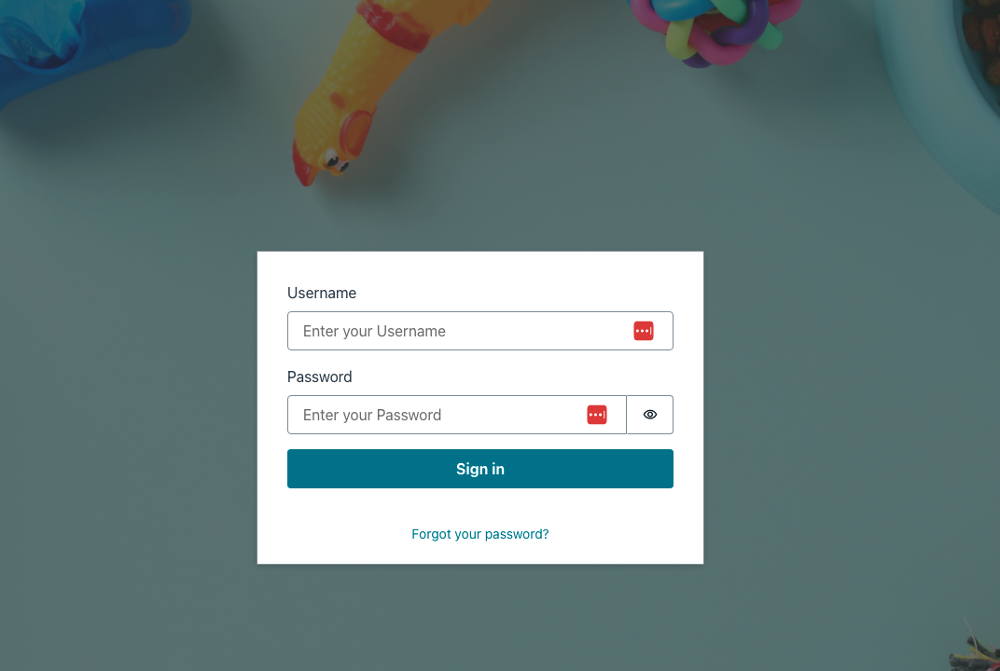
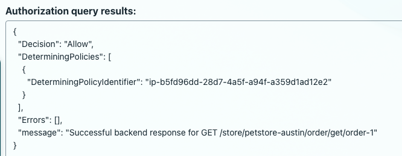

[](https://console.aws.amazon.com/amplify/home#/deploy?repo=https://github.com/aws-samples/avp-petstore-sample)

# Introduction
This sample web application demonstrates authentication and policy-based authorization of diffrent user types to an imaginary Pet Store web app. This application uses Amazon Cognito for authentication and uses Amazon Verified Permissions for policy-based authorization, the application uses Amplify platform to accelerate deployment and provisioning of backend resources.

The first step to test this sample application is to login to your AWS console then click the link above to deploy this sample application in your AWS account using Amplify hosting. This will also create backend resources needed for the application like Amazon Cognito user pool, API Gateway project and Lambda function to simulate backend service. Application will go through provision, build and deploy stages and might take several minutes to complete.


After successful deployment of the sample application, follow the steps below to create users, groups and authorization policies and test authorization scenarios.

### Managing users and groups in Amazon Cognito:
In this section, you will create users and groups, add custom attributes to the users and assign users to their groups to simulate customer and store owner personas.

1. Navigate to Amazon Cognito service in the AWS Console
2. Search for the [petstoresample...] Cognito User Pool that was created by Amplify, navigate to the Users tab and click on Create user button
3. We need to create 3 users to fully test the functionality of this application, a customer account, a store owner account and "abhi" who represents a customer with an existing order.
    1. First lets create “abhi”. This will be used to test Customer-GetOrders policy which we will cover later in the Verified Permissions section of the setup guide. This username is hard coded as the order owner in Lambda code for demonestration purposes, so you need to create the user with the exact username.
    Create the user as explained in the screenshot below
    
    
    2. Similarly, create two more users with any usernames of your choice for the customer and store-owner personas
        1. Edit store-owner user to add custom attribute to indicate that they are an employee of a certain store, to do this first visit user profile by clicking on the username
        
        2. Click “Add Attribute” at the bottom of the screen and add the attribute and value below
        
4. Now we need to create groups to represent customers and store-owners and add these users to the appropriate group.
    1. Under the groups tab in Cognito, click “create group”
    
    2. Group names need to be exactly as shown, these group names are part of the tokens issued by Cognito and will be used for Role-based access control (RBAC)
    3. The “Customer” group needs to include “abhi” and the other "customer" user you have created
    4. The “Store-Owner-Role“ group should include the store-owner user with employmentStoreCode attribute
Cognito user pool now has the users and groups needed for demonestration of this application.
### Managing permissions in Amazon Verified Permissions:
In this section, we will create Amazon Verified Permissions policy-store, schema and policies to represent the authorization model for the application.
#### Schema:
1. Navigate to Amazon Verified Permissions in the Console
2. Click on “Schema“ in the left menu
3. You will see a page like the following, click edit in the upper left section of the page.
4. 
5. Delete the current contents, and paste in the following.
```
{
    "MyApplication": {
        "actions": {
            "GetOrder": {
                "appliesTo": {
                    "principalTypes": [
                        "User"
                    ],
                    "resourceTypes": [
                        "Order"
                    ]
                }
            },
            "GetStoreInventory": {
                "appliesTo": {
                    "principalTypes": [
                        "User"
                    ],
                    "resourceTypes": [
                        "Application"
                    ]
                }
            },
            "ListOrders": {
                "appliesTo": {
                    "principalTypes": [
                        "User"
                    ],
                    "resourceTypes": [
                        "Application"
                    ]
                }
            },
            "PlaceOrder": {
                "appliesTo": {
                    "principalTypes": [
                        "User"
                    ],
                    "resourceTypes": [
                        "Application"
                    ]
                }
            },
            "SearchPets": {
                "appliesTo": {
                    "principalTypes": [
                        "User"
                    ],
                    "resourceTypes": [
                        "Application"
                    ]
                }
            }
        },
        "entityTypes": {
            "Application": {
                "memberOfTypes": [],
                "shape": {
                    "attributes": {
                        "storeId": {
                            "name": "storeId",
                            "type": "String"
                        }
                    },
                    "type": "Record"
                }
            },
            "Order": {
                "memberOfTypes": [],
                "shape": {
                    "attributes": {
                        "owner": {
                            "name": "User",
                            "type": "Entity"
                        }
                    },
                    "type": "Record"
                }
            },
            "Pet": {
                "memberOfTypes": [],
                "shape": {
                    "attributes": {
                        "owner": {
                            "name": "User",
                            "type": "Entity"
                        }
                    },
                    "type": "Record"
                }
            },
            "Role": {
                "memberOfTypes": [],
                "shape": {
                    "attributes": {},
                    "type": "Record"
                }
            },
            "User": {
                "memberOfTypes": [
                    "Role"
                ],
                "shape": {
                    "attributes": {
                        "employmentStoreCode": {
                            "type": "String"
                        }
                    },
                    "type": "Record"
                }
            }
        }
    }
}
```
7. Click “save changes.”
#### Policies:
1. Now click on “Policies” in the left menu
2. You will need to add the following policies
Customer Role - This policy allows customers to search for pets and place orders, this is a role-based access control policy (RBAC)
```
permit (
    principal in MyApplication::Role::"Customer",
    action in [MyApplication::Action::"SearchPets", MyApplication::Action::"PlaceOrder"],
    resource
);
```
Customer Role - Get Order, this policy allows customers to get details of their orders. This is an example of both role-based and attribute-based access control policy, principal must be in the role Customer and also principal has to be the owner of the order to be allowed to take the GetOrder action.
```
permit (
    principal in MyApplication::Role::"Customer",
    action in [MyApplication::Action::"GetOrder"],
    resource
) when {
    principal == resource.owner
};
```
Store Owner no store check, this is a RBAC policy that allow store owners to get inventory and list of orders.
```
permit (
    principal in MyApplication::Role::"Store-Owner-Role",
    action in [
        MyApplication::Action::"GetStoreInventory",
        MyApplication:: Action::"ListOrders"
    ],
    resource 
);
```
#### Configuring the application to use the recently created policy store:
The backend lambda function uses an environment variable to reference the AVP policy-store, lambda function has been created by Amplify and has a placeholder that need to be edited to have the value of the correct policy-store.
1. In AVP console, navigate to the “Settings“ section on the left menu
2. Copy the Policy Store ID 
3. Navigate to the Lambda Service console
4. Search for and select the [Petstoresample...] lamdba function and click the “configuration” tab.
5. 
6. Next click on the environment variables along the left menu and edit to update the Policy Store ID to what you copied from AVP Policy Store settings, and save.
7. Congratulations, Amazon Verified Permissions is now set and your application is ready for testing.
### Testing the Application:
Petstore sample application allows a user to sign-in and take certain actions from the frontend, these actions send HTTPS requests to backend lambda function through API Gateway passing the user token as a form of authorization, backend lambda function extract information about the request, user token and the resource being accessd then create an authorization query to Amazon Verified Permissions to get a decision, based on the decision the call is allowed or denied by the backend lambda function.

You can review the backend lambda code by visiting [Petstoresample...] lamdba function that was created by Amplify in your AWS account.

To test the application, follow these steps:

1. Navigate to AWS Amplify and click on the petstore-sample application

2. select the link under your front end of the application in order to launch in another Tab the Application UI.

3. You should see a login screen like the one below.

4. First login as "abhi" 
    1. When you log in as a customer, you will see the “Customer role type actions“ menu. As you attempt each of the following actions, you will see authorization results on the right side of the screen with a permit or deny decision from AVP and the corresponding reason. 
    
    2. Select, Search Pets, and see the result on the right side. Next try Place order and view the result again.
    3. As you select View Order, as abhi, you will get a successful message like the one shown below, this is due to the fact that abhi is listed as the resource owner for the resource, order-1.
    
    4. Sign out of the abhi persona and lets move on to the next customer user.
5.  Sign in as the 2nd Customer user.
    1. When you sign in, you will see the same “Customer role type actions“ menu as we did with the abhi persona.
    2. Select, Search Pets, and see the result on the right side. Next try Place order and view the result again. As before you will see a corresponding success as shown below. 
    
    3. Now as you try View Order, you will yield a failure message like the one shown below, this is due to the fact that customer user 2 is NOT listed as the resource owner for the resource, order-1.
    
    4. Sign out of the customer 2 persona and lets move on to the store owner user.
6. Next, log in as the StoreOwner and assess your api access. Try with and without defining the petstore in the input field (options are: “petstore-london“ and “petstore-austin”).
    
7. In the next test, we will limit store owner permissions to only the store they own, this change will add attribute-based access control to the store owner policy. Edit the store owner policy to add the condition below

    Store Owner with store check
    ```
    permit (
        principal in MyApplication::Role::"Store-Owner-Role",
        action in [
            MyApplication::Action::"GetStoreInventory",
            MyApplication:: Action::"ListOrders"
        ],
        resource)
    when { principal.employmentStoreCode == resource.storeId };
    ```
    Now when you try the application, if you put “petstore-austin” in the prompt box you will get a Deny and if you put “petstore-london” in the prompt box you will get an Allow. This is because the application is leveraging the “storeowner” attribute passed in the JWT to limit their access in accordance to the more restrictive Policy that identifies the specific store location the persona manages.
